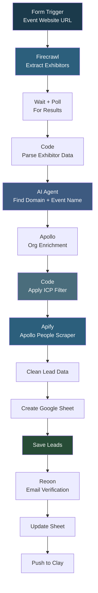

# Main Flow

## Overview

This is a comprehensive event exhibitor lead generation pipeline. It takes an event website URL, uses Firecrawl to extract exhibitor data (names, booth numbers, descriptions), then uses an AI agent to find each company's domain and the event name from the logo. Each company is enriched through Apollo to find the organization ID, filtered by ICP criteria (US-based B2B tech companies with 50+ employees), and then sales decision-makers are scraped from Apollo. Leads are cleaned, saved to a dynamically created Google Sheet, verified via Reoon, and pushed to Clay for further enrichment.

## How It Works

```
Form (event website URL) -> Firecrawl Extract (exhibitors, booth numbers, descriptions) -> Wait + Poll -> Parse exhibitor data -> AI Agent (find company domain + event name) -> Apollo Org Enrichment -> ICP Filter (US, 50+ employees, B2B tech) -> Apify Apollo People Scraper -> Clean lead data -> Create Google Sheet -> Save leads -> Email Verification (Reoon) -> Update sheet -> Push to Clay
```

### Workflow Diagram



## Integrations

- **Firecrawl** - Event website scraping and exhibitor extraction
- **OpenAI (GPT-4o)** - Company domain research and event identification
- **Apollo** - Organization enrichment and people matching
- **Apify** - Apollo people scraping
- **Reoon** - Email verification
- **Google Sheets** - Dynamic spreadsheet creation and lead storage
- **Clay** - Lead enrichment webhook

## Setup

1. Import `Main_Flow.json` into your n8n instance.
2. Configure credentials for OpenAI and Google Sheets.
3. Update the Firecrawl API key, Apollo API key, Apify token, Reoon API key, and Clay webhook URL.
4. Customize the ICP filter criteria in the "Apply ICP" code node if needed.
5. Activate the workflow and submit the form with an event exhibitor page URL.
